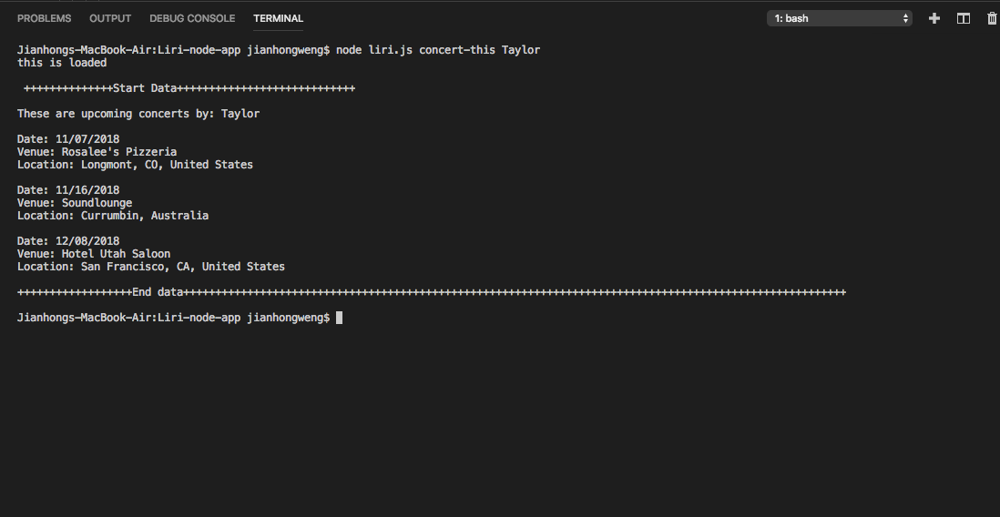
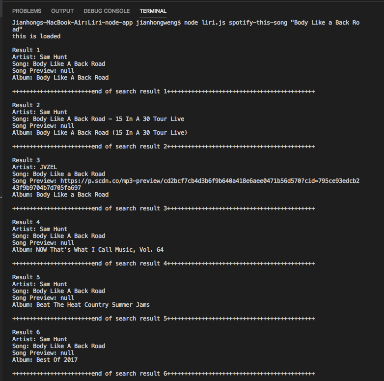
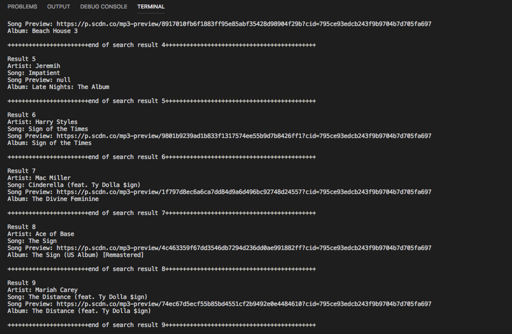
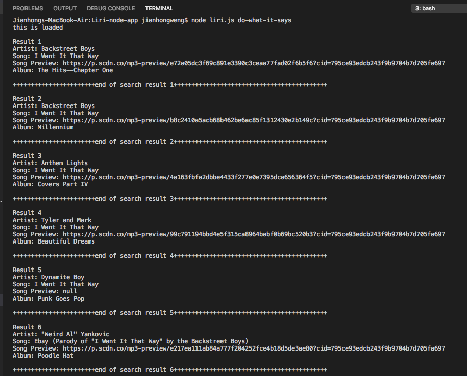

# LIRI node app
-----------------------------
This is an app called LIRI. LIRI is a _Language_ Interpretation and Recognition Interface. LIRI will be a command line node app that takes in parameters and gives user back with data. LIRI will search **Spotify** for songs, **Bands in Town** for concerts, and **OMDB** for movies.
## Set up LIRI
-----------------------------
**_Prerequisites_:**
**In order to use LIRI, ensure you have nodeJS and node packages installed.Also need to download the Liri_node-app file from GitHub**
- Install node packages:
    - Open a terminal.
    - Navigate to Liri-node-app folder containing **liri.js**.
    - Enter the command ```npm i```.

## How to use LIRI commands
-----------------------------
**All commands should be entered in liri-node-app directory in the terminal.**

**Command 1:**
    ```node liri.js concert-this 'artist/band name you want to search'```

 This will search the **Bands in Town** _Artist Events API_ for an artist and render the following information about each event to the terminal:
     * Name of the venue
     * Venue location
     * Date of the Event

**example of command 1:**


**Command 2:**
   ``` node liri.js spotify-this-song "song's name to look for"  ```
 This will search the **Spotify API** and show the following information about the song in the terminal:

     * Artist(s)
     * The song's name
     * A preview link of the song from Spotify
     * The album that the song is from

**example for command 2 with song entered**


If no song is provided then the program will default to "The Sign" by Ace of Base.

**example for commmand 2 with no song entered**


**_Notes_:**
You will need your own spotify api keys to make this work.

**Command 3:**

   ``` node liri.js movie-this 'movie name you want to see'```

This will search the **OMDB** and will output the following information to your terminal:

       Title of the movie.
       * Year the movie came out.
       * IMDB Rating of the movie.
       * Rotten Tomatoes Rating of the movie.
       * Country where the movie was produced.
       * Language of the movie.
       * Plot of the movie.
       * Actors in the movie.

If you do not type a movie in, the program will output data for the movie 'Mr. Nobody.'

**example of command 3:**
this image shows the two conditions described above. 


**Command 4:**

   ``` node liri.js do-what-it-says```

LIRI will take the text inside of random.txt and then use it to call one of LIRI's commands.

It will run `spotify-this-song` command and search for the song's name  "I Want it That Way," as the text in the `random.txt`.

**example of command 4:**



You could try to edit the text in the `random.txt` file to try other commands


